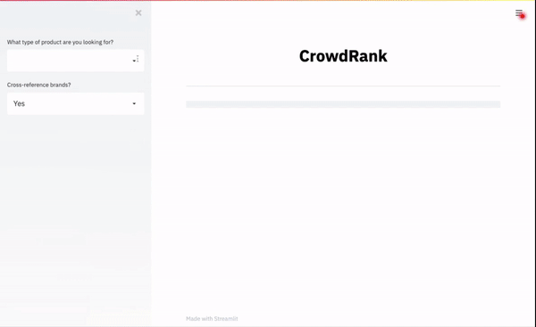

 &nbsp;&nbsp;&nbsp;
&nbsp;&nbsp;&nbsp;
 

## Description
CrowdRank is a package and app for interpreting community sentiments about brands and products from Reddit data. From a single product name (headphones, computers, laptops, tvs), CrowdRank skims through thousands of relevant comments, aggregates and scores the results, and gives back a ranking of the best brands in that product space.

Stack: Python, AWS EC2 & S3, JSON  
NLP Models: [SpaCy](https://github.com/explosion/spaCy) [Named Entity Recognition], [VADER](https://github.com/cjhutto/vaderSentiment) [Sentiment Analysis].    
Packages: Requests, Streamlit, Pandas, Fuzzywuzzy...  

This project was completed in 4 weeks as an AI Fellow at Insight Data Science, more information in these [slides](https://docs.google.com/presentation/d/1WD1oYS2C91xizfJuv1zhWhu-tA53MBWnLTIYSArWMA8/edit?usp=sharing).

## Data
Queried with [Pushshift's API](https://reddit-api.readthedocs.io/en/latest/) which indexes over 4 billion comments, dating back to 2007.  

The web app stores comment and post data on S3, while the package stores data locally. Brand rankings exist for 9 products (headphones, laptops, computers, monitors, TVs, keyboards, mice) which are inferred from 35K+ comments across almost 20 subreddits.

## Motivation
210 million Americans shop online every year and 80% of them do research before purchasing an item. There are 1000s of products in the same category (e.g. Wireless Headphones) with over 4 stars, making it almost impossible to sort through them. What if we could tap into the collective knowledge of communities, to help users quickly find the best brands and products?

## Web app
Run the web app inside /scripts:  

    streamlit run crowdrank_app.py

Or simply use the app here:   

http://54.177.99.61:8501  

(hosted on an EC2 instance with data on S3)  

## Package
Run the package to see the best brands of a product (e.g. laptops):

    python crowdrank_simple.py laptops

(inside scripts)

CrowdRank has 3 main modules: *ingester*, *interpreter*, *postprocessing*, which do the bulk of the work. Supporting functions are in the *helpers* and *visualizer* modules. The above script will be replaced by a single call to *ranker*:

    from crowdrank import ranker  
    df_ranking = ranker.rank('laptops')  

## Installing
Clone the repository:  

    git clone https://github.com/LucDoh/CrowdRank.git  

Make subdirectories within data:  

    mkdir comment_data interpreted_data submission_data results

Install requirements:  

    pip install -r requirements.txt  
    python -m spacy download en_core_web_md
